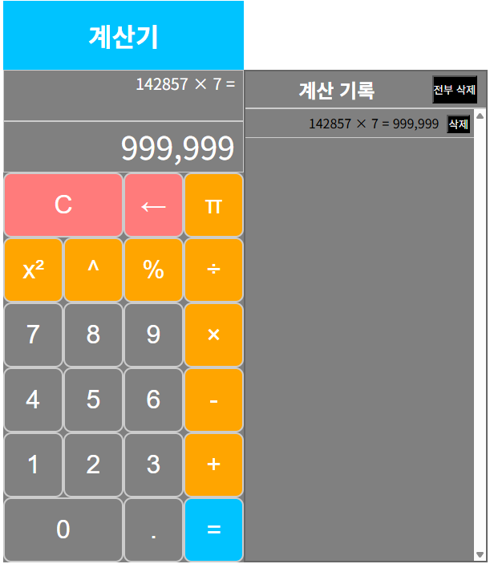

# Calculator
브라우저 기반 계산기. 계산 기록 기능 제공

## 데모

## 주요 기능
- 사칙연산, 제곱, 나머지 연산
- 계산 기록: 계산 기록을 확인하고 삭제 가능

## 기술 스택
 - HTML/CSS/Vanilla JS(모듈 없음)

## 폴더 구조
### UI 골격
index.html
### UI 디자인(버튼, 수식, 계산 기록)
assets/css/style.css
### 사용자 입력(버튼 클릭, 키보드 입력) 제어, 계산 기록 추가 및 제거 기능
assets/js/script.js